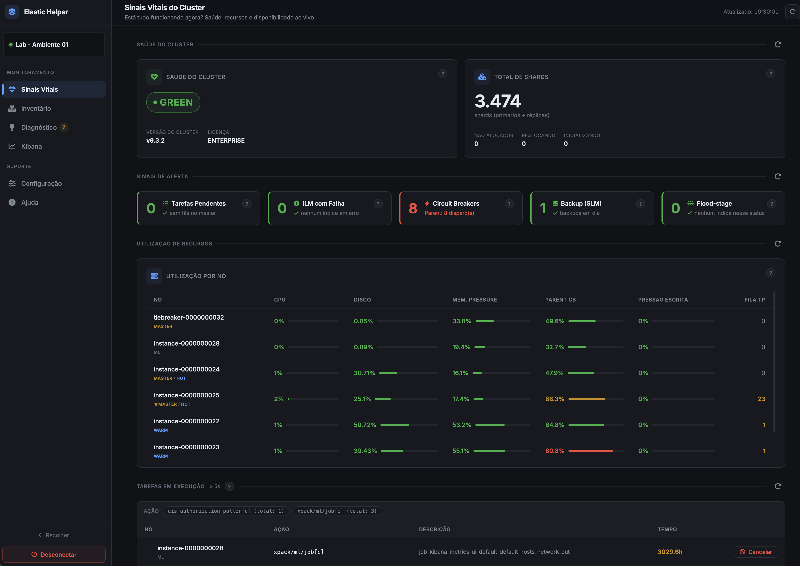

# Elastic Helper 

Ferramenta web local para **pré-análise de clusters Elasticsearch**. Conecta a um cluster, consulta
as APIs de monitoramento e apresenta em um dashboard o que costuma ser preciso descobrir no começo
de uma análise: saúde, uso de recursos, distribuição de shards, higiene de configuração dos índices
e os pontos que merecem atenção.

As chamadas ao cluster são de **leitura**. A única exceção é o **cancelamento de uma tarefa em
execução**, disparado explicitamente por quem usa a ferramenta.

Captura da tela "Sinais Vitais":



## Páginas

| Página | O que mostra |
|--------|--------------|
| **Sinais Vitais** | "Está funcionando agora?" — saúde do cluster, shards, circuit breakers, ILM com falha, backup (SLM), uso de CPU/heap/disco por nó e as tarefas em execução |
| **Inventário** | Nós, volume de dados, documentos, índices, capacidade por tier de dados e configuração dos índices (sem réplica, sem ILM, shards primários grandes, ILM sem fase delete) |
| **Diagnóstico** | Leitura interpretada dos mesmos dados: um card por problema encontrado, com severidade e link para o detalhe. Só aparece o que de fato ocorre |
| **Kibana** | Instâncias do Kibana, Task Manager, Fleet e APM Server. Opcional — a página só aparece com a integração ativada |
| **Configuração** | Integrações e preferências da conexão atual |
| **Ajuda** | Documentação de cada card e de cada métrica exibida, com busca |

Cada card abre um detalhamento com a lista completa por índice, nó ou política, com busca, ordenação
e exportação da lista em JSON.

## Versões suportadas

**Elasticsearch 8.0 até 9.x.** O cliente usado é o `elasticsearch-py` v8; clusters 9.x funcionam
pela compatibilidade REST N-1, em que o servidor aceita requisições do major anterior.

**7.x não é suportado** — um servidor 7.x rejeita o cabeçalho de compatibilidade do cliente v8.

## Como executar

```bash
./start.sh
```

Na primeira execução o script cria o ambiente virtual, copia `.env.example` para `.env` e instala as
dependências. A aplicação sobe em <http://localhost:5001>.

### Com Docker

```bash
touch connections.db
docker compose up --build
```

O `touch` prévio é necessário: o banco é montado por bind, e o Docker cria um diretório no lugar de
um arquivo inexistente. Container e execução local compartilham o mesmo `connections.db`.

## Configuração

O `.env` controla apenas a aplicação:

```dotenv
PORT=5001        # porta do servidor
LOG_LEVEL=INFO   # DEBUG | INFO | WARNING | ERROR
```

`LOG_LEVEL=DEBUG` também ativa o reloader do Flask. Há ainda `DB_PATH`, que define onde fica o banco
SQLite das conexões salvas (padrão: `connections.db` na raiz do projeto).

Os dados do cluster **não** vão no `.env`: host, porta, usuário e senha são informados na tela de
conexão e podem ser salvos para reuso, com um apelido por ambiente.

## Requisitos

- Python 3 (a imagem Docker usa 3.11)
- Acesso de rede ao cluster e um usuário com privilégios de leitura das APIs de monitoramento

Recursos que dependem de permissões específicas (licença, deprecations, SLM, ILM, Fleet) degradam
individualmente: o card correspondente informa que o dado está indisponível e o restante do
dashboard continua funcionando.

## Escopo e limitações

É uma ferramenta de uso **local**, feita para rodar na máquina de quem está analisando o cluster:

- não há autenticação nem sessão — quem alcança a porta usa a aplicação;
- as conexões salvas ficam em um SQLite local, com a senha em texto puro;
- a conexão HTTPS não valida o certificado do cluster, o que permite apontar para ambientes com
  certificado autoassinado.

Não exponha a porta em rede pública.

## Licença

[MIT](LICENSE).
